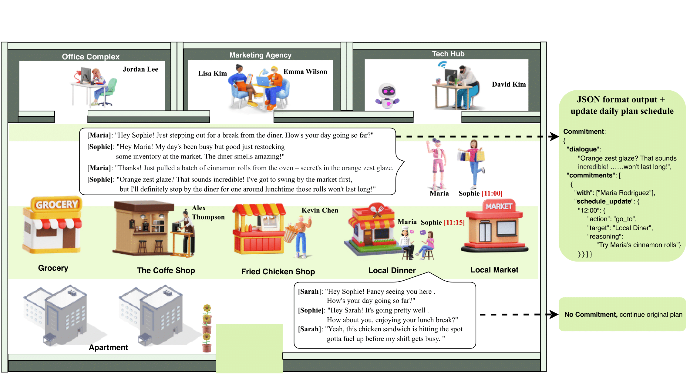
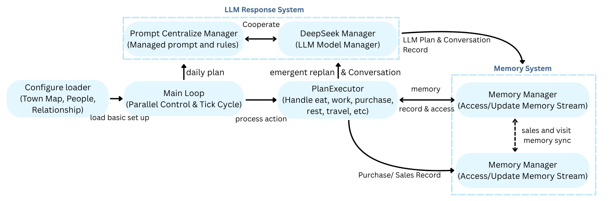

## 1. 🎯 Problem Statement & Business Goal

**The Challenge:** Traditional marketing models (like Markov Chains or linear regressions) often fail to capture the complex, non-linear **social dynamics** (like **word-of-mouth diffusion** and rumor spreading) that drive real-world consumer behavior and product adoption. Evaluating marketing campaigns is typically a costly, post-event process.

**The Goal:** To develop a scalable, low-risk, and realistic **pre-implementation testing tool** for marketing teams by creating a virtual town environment where LLM-driven agents simulate human interaction and decision-making.

---

## 2. 🏗️ System Architecture & Agentic Workflow



### Experiment Flow



### A. Core Agent Components (The LLM "Brain")

Each agent is a stateful entity defined by a structured **JSON** output, using the LLM for the following functions:

1. **Perception:** Processes observations from the environment (price, location, inventory) and social network (word-of-mouth messages).
2. **Memory:** Maintains a **personalized memory stream** (recent interactions, personal experiences, internal state like hunger/budget).
3. **Reasoning Pipeline:** The core logic, where the LLM uses its memory and persona to generate a structured thought process for a purchase decision.
4. **Action:** Generates a verifiable action (e.g., `[Buy Product X]`, `[Go to Location Y]`, `[Share Review]`).

### B. End-to-End Simulation Structure

**System Flow:**
```
External Environment (Price/Inventory)
    → Agent Perception
    → LLM (Reasoning/Decision)
    → Action (Purchase/Review)
    → Update Social Network/Database
    → Simulation Loop
```

**Data Management:** The simulation runs on a multi-threaded system to process thousands of agent-turns per cycle. Agent state (memory, budget, location) is persisted and managed to ensure **temporal consistency** and **realistic habit formation.**

**Key Technical Components:**
- **11 autonomous agents** navigating a 10×10 grid virtual town
- **10 locations** (dining, shopping, work, leisure, residential)
- **Energy system** with realistic constraints (hunger, sleep, income)
- **Memory retrieval** scoring (recency, importance, relevance)
- **Thread-safe parallel execution** for scalability

---

## 3. 📊 Key Results & Marketing Science Insights

The simulation provided actionable insights that could not be easily gathered with traditional methods, demonstrating the value of a **Marketing Science** approach.

### Case Study: Price Discount Impact

* **Hypothesis:** A **20% discount** would lead to a sustained increase in sales.
* **Simulation Result:** Testing the discount revealed a **3.5x increase in short-term sales** (confirming elasticity), but the long-term simulation showed emergent patterns of **brand perception changes** due to agents internalizing the lower price as the new normal (modeling price sensitivity/erosion).

### Social Dynamics & Word-of-Mouth

* **Result:** Successfully modeled **heterogeneous consumption patterns** (exploratory, habitual, variety-seeking behaviors).
* **Key Insight:** Simulations with positive agent reviews showed **faster product adoption** compared to simulations with neutral/negative reviews, providing a quantifiable metric for social media strategy impact.

### Emergent Behaviors (Without Hard-Coded Rules)

- **Social coordination:** Agents autonomously formed group dining patterns
- **Information diffusion:** Word-of-mouth spread organically through agent conversations
- **Loyalty formation:** Repeated positive experiences led to habitual behavior
- **Substitution effects:** Price-sensitive agents switched between competing locations

---

## 4. 🧠 Technical Depth & Implementation Challenges

### Prompt Engineering for Reliability

- Designed **7,000+ character daily planning prompts** to mitigate LLM hallucination
- Implemented **menu validation system** to prevent invalid food orders
- Created **emergency fallback mechanisms** for edge cases (energy depletion, invalid locations)

### Performance Optimization

- **DeepSeek API integration** with prompt caching for efficiency
- **Multi-threading in Python** to handle parallel LLM calls (11 agents × 168 hours = 1,848 planning cycles)
- **BFS pathfinding** for realistic movement in virtual town
- **Thread-safe state tracking** for location and agent states

### Data Pipeline & Validation

- **Metrics collection:** Sales transactions, location visits, conversation logs
- **JSONL output format** for scalable data storage (Git LFS for >100MB conversation logs)
- **Daily business summaries** with revenue analysis and item popularity
- **Agent memory persistence** for temporal consistency

---

## 5. 🚀 Business Impact & Future Work

### Practical Applications

This framework enables marketing teams to:
- **Pre-test campaigns** before real-world deployment (reducing risk and cost)
- **Simulate competitor responses** to pricing strategies
- **Model long-term brand effects** of promotional tactics
- **Quantify social influence** impact on product adoption

### Future Enhancements

- **Retrieval-Augmented Generation (RAG):** Integrate dynamic knowledge base (news articles, competitor pricing) for more sophisticated financial planning
- **Multi-product ecosystems:** Expand from single-location discounts to cross-category bundle strategies
- **Real-world calibration:** Validate simulation outputs against actual A/B test results
- **Heterogeneous agent personas:** Increase diversity in income levels, cultural backgrounds, and decision-making styles

---

## 6. 📝 Publication & Recognition

**Paper:** Chu, M., Terhorst, L., Reed, K., Ni, T., Chen, W., & Lin, R. (2025). *LLM-Based Multi-Agent System for Simulating and Analyzing Marketing and Consumer Behavior.* arXiv preprint arXiv:2510.18155. Published October 2025.

**Citation:**
```bibtex
@article{chu2025multiagent,
  title={LLM-Based Multi-Agent System for Simulating and Analyzing Marketing and Consumer Behavior},
  author={Chu, Man-Lin and Terhorst, Lucian and Reed, Kadin and Ni, Tom and Chen, Weiwei and Lin, Rongyu},
  year={2025},
  journal={arXiv preprint arXiv:2510.18155},
  url={https://arxiv.org/abs/2510.18155}
}
```
