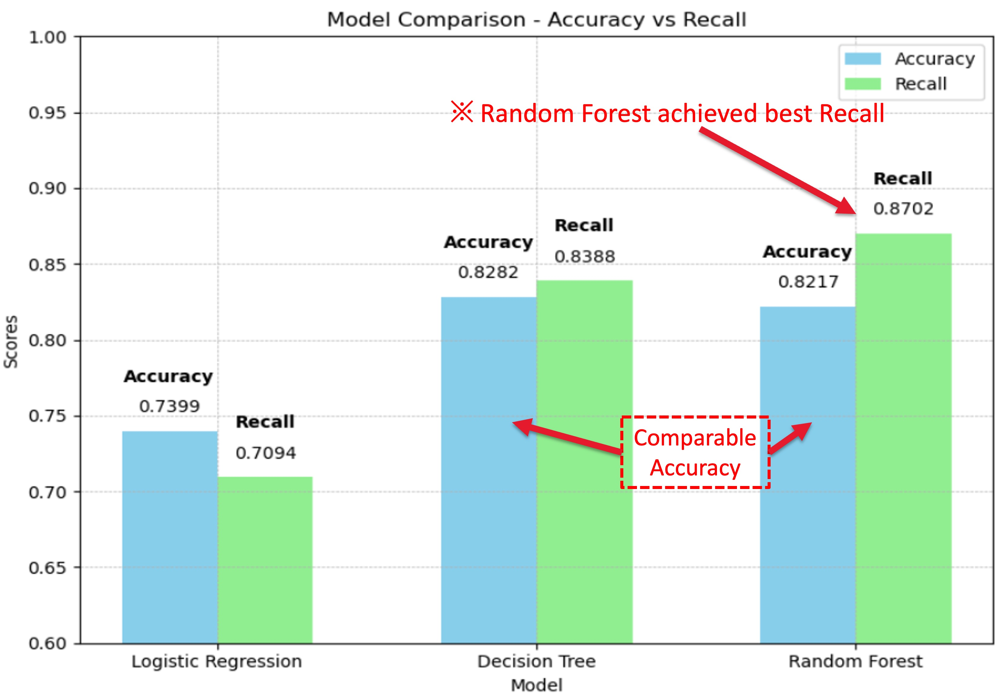
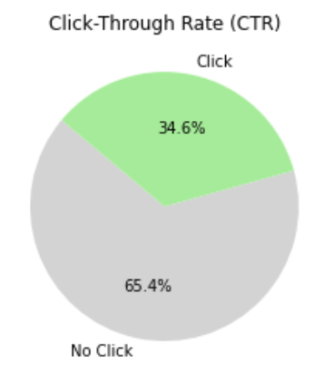

    <h1 class="hero-title">Carol Chu</h1>
    
Marketing Science Professional

    
Applying Data Analytics, Machine Learning and AI into actionable business insight.

    

        <h4>Analytics ▼</h4>
        

            
<strong>Programming:</strong> Python, R, SQL, PySpark

            
<strong>Data Pipelines:</strong> Databricks, ETL

        

    

    

        <h4>LLM ▼</h4>
        

            
NLP, NLTK, Regex, SciPy, Tokenization, TF-IDF

        

    

    

        <h4>ML ▼</h4>
        

            
Feature Engineering, Class Imbalance, Supervised/Unsupervised Models

        

    

    

        <h4>Gen-AI ▼</h4>
        

            
Prompt Engineering, Multi-Agent Simulation, GenAI Workflow Automation

        

    

    

        <h4>Dashboarding ▼</h4>
        

            
Google Analytics 360, Tableau, Looker Studio, PowerBI

        

    

    

        <h4>Business ▼</h4>
        

            
Marketing, PR, Strategy

        

    

## Applied Industrial Project

    <button class="filter-button active" data-filter="all">All</button>
    <button class="filter-button" data-filter="ai-llm">AI & LLM</button>
    <button class="filter-button" data-filter="marketing">Marketing</button>
    <button class="filter-button" data-filter="healthcare">Healthcare</button>

    

        
Flagship Research

        <h3 class="card-title">LLM-Based Multi-Agent Consumer Behavior Simulation</h3>
        
Pre-deployment marketing strategy testing is expensive and resource-intensive. This project uses an LLM-based multi-agent sandbox to simulate consumer behavior and decision-making at scale. Published on arXiv as first author.

        
Prompt Engineering · Multi-Agent Simulation · Consumer Behavior · Word-of-Mouth · Marketing Science

        

            <a href="/projects/llm-simulation/" class="btn btn-primary">Learn More</a>
            <a href="https://arxiv.org/abs/2510.18155" class="btn btn-outline" target="_blank">Read Paper</a>
        

    

    

        
    

    

        
Award Winner

        <h3 class="card-title">Prostate Cancer Prediction - ML Clinical Diagnosis Support</h3>
        
Unnecessary prostate biopsies cost the US healthcare system $12B annually and put healthy patients at risk. This project built a machine learning model to pre-screen 73,530 patients and reduce unnecessary biopsies by 20-30%. Bronze Prize at Clark University Analytics Competition.

        
Healthcare ML · Clinical Decision Support · Random Forest · SMOTE · Class Imbalance

        

            <a href="/projects/prostate-cancer/" class="btn btn-primary">Learn More</a>
            <a href="https://github.com/carolchu1208/ML_ProstateCancerPrediction" class="btn btn-outline" target="_blank">GitHub</a>
        

    

    

        
    

    

        
TechAd ML Optimization

        <h3 class="card-title">Ad Click Prediction - ML Model Optimization on Incomplete Data</h3>
        
Real-world marketing data is messy—48% missing values make accurate ad targeting difficult and wasteful. This project built a click prediction model that handles incomplete data and identifies which customers to target, when, and where. Achieved 81% F1-score with 60% improvement over baseline.

        
Marketing Analytics · PySpark ML · Feature Engineering · Missing Data · A/B Testing

        

            <a href="/projects/ad-click-prediction/" class="btn btn-primary">Learn More</a>
            <a href="https://github.com/carolchu1208/AdClickPrediction_ML_PySpark" class="btn btn-outline" target="_blank">GitHub</a>
        

    

    

        
    

